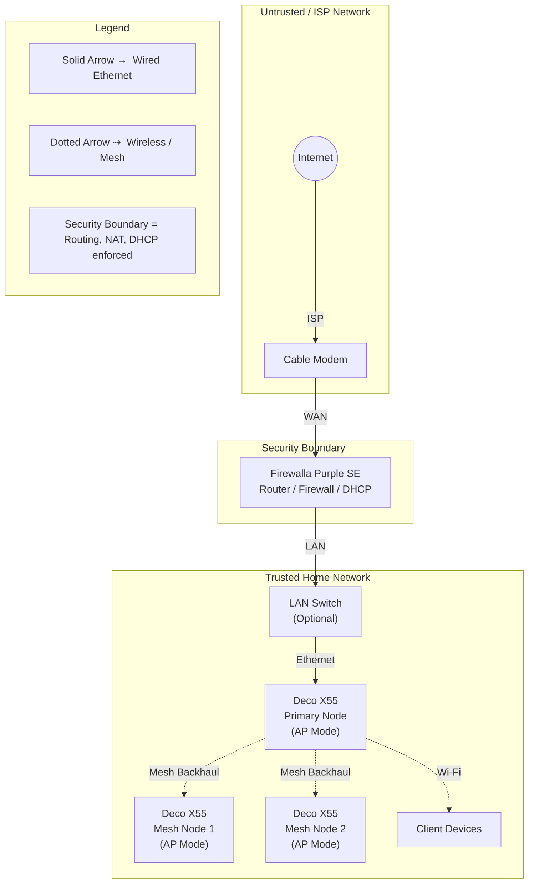

# Current Network Diagram

```mermaid
flowchart TB
    %% ===== Zones =====
    subgraph WAN_ZONE["Untrusted / ISP Network"]
        Internet((Internet))
        Modem[Cable Modem]
    end

    subgraph TRUST_BOUNDARY["Security Boundary<br/>(NAT / Firewall / DHCP)"]
        Firewalla["Firewalla Purple SE<br/>Router / Firewall / DHCP"]
    end

    subgraph LAN_ZONE["Trusted Home Network"]
        Switch["LAN Switch<br/>(Optional)"]
        DecoMain["Deco X55<br/>Primary Node<br/>(AP Mode)"]
        DecoNode1["Deco X55<br/>Mesh Node 1<br/>(AP Mode)"]
        DecoNode2["Deco X55<br/>Mesh Node 2<br/>(AP Mode)"]
        Clients["Client Devices"]
    end

    %% ===== Links =====
    Internet -->|ISP| Modem
    Modem -->|WAN| Firewalla
    Firewalla -->|LAN| Switch
    Switch -->|Ethernet| DecoMain
    DecoMain -.->|Mesh Backhaul| DecoNode1
    DecoMain -.->|Mesh Backhaul| DecoNode2
    DecoMain -.->|Wi-Fi| Clients

    %% ===== Legend =====
    subgraph LEGEND["Legend"]
        L1["Solid Arrow →  Wired Ethernet"]
        L2["Dotted Arrow ⇢  Wireless / Mesh"]
        L3["Security Boundary = Routing, NAT, DHCP enforced"]
    end
```