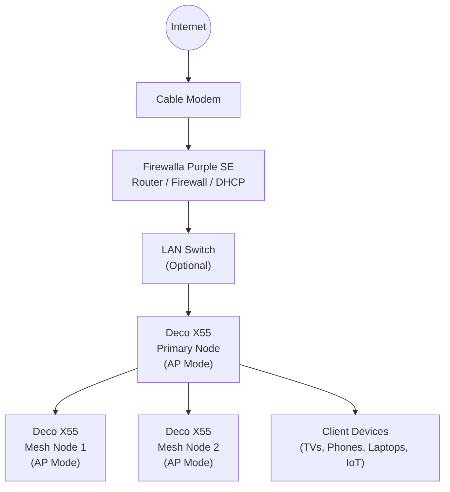

# Current network diagram

```mermaid
flowchart TB
    Internet((Internet))
    Modem[Cable Modem]
    Firewalla["Firewalla Purple SE<br/>Router / Firewall / DHCP"]
    Switch["LAN Switch<br/>(Optional)"]
    DecoMain["Deco X55<br/>Primary Node<br/>(AP Mode)"]
    DecoNode1["Deco X55<br/>Mesh Node 1<br/>(AP Mode)"]
    DecoNode2["Deco X55<br/>Mesh Node 2<br/>(AP Mode)"]
    Clients["Client Devices<br/>(TVs, Phones, Laptops, IoT)"]

    Internet --> Modem --> Firewalla --> Switch --> DecoMain
    DecoMain --> DecoNode1
    DecoMain --> DecoNode2
    DecoMain --> Clients
```