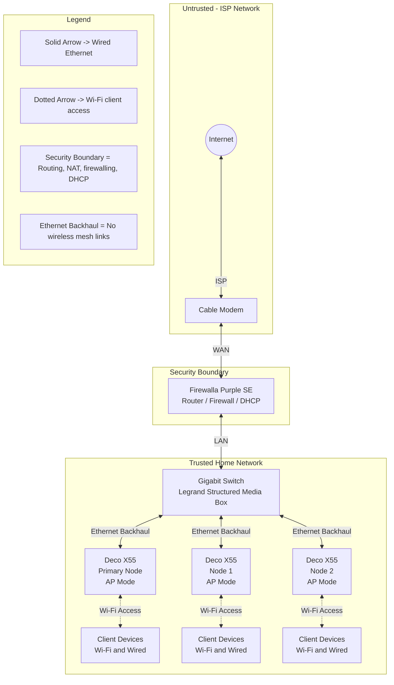

# Current Network Diagram


# Implementation--

## Phase 1 — Pre-Stage the Deco Mesh (No Outage)

**Goal:** Remove all routing/DHCP behavior from the Deco system *before* inserting the new router.

1. Open the **Deco app**
2. Navigate to:
   **More → Advanced → Operation Mode → Access Point**
3. Apply the change
4. Reboot **all** Deco nodes
5. Verify:

   * Deco reports **Access Point mode**
   * Wi-Fi remains functional
   * No DHCP warnings appear on clients

Leave the Deco system powered on and connected LAN-side only.

## Phase 2 — Router Cutover (Planned Outage)

**Goal:** Insert Firewalla as the *only* Layer-3 device.

### Step 1 — Physically Remove the Old Router Path

(The “old router” is the main Deco unit.)

1. Power **off**:

   * Cable modem
   * Firewalla
   * All Deco units
2. Disconnect the Ethernet cable between:

   * Cable modem → main Deco

At this point, the Deco system has **no WAN path**.

---

### Step 2 — Insert Firewalla

1. Connect:

   * **Cable modem → Firewalla WAN**
2. Connect:

   * **Firewalla LAN → switch**
     **OR**
   * **Firewalla LAN → main Deco LAN port**

Do **not** power anything on yet.

---

### Step 3 — Power-On Sequence (Critical)

1. Power on **cable modem**

   * Wait until fully online (ISP lights stable)
2. Power on **Firewalla Purple SE**

   * Firewalla automatically:

     * Acts as a DHCP client on WAN
     * Brings up a temporary LAN for onboarding
3. Leave Deco powered **off** for now

---

### Step 4 — Firewalla First-Time Setup & WAN Confirmation

1. Open the **Firewalla mobile app**
2. Start **Add Firewalla**
3. Complete onboarding
4. Confirm in the app:

   * WAN status = **Connected**
   * WAN IP assigned by ISP
   * Internet access confirmed

If WAN is **not** connected:

* Power-cycle the modem
* Ensure only Firewalla is connected
* Retry onboarding

---

### Step 5 — Bring the Deco Mesh Online

1. Power on **all Deco units**
2. Confirm in the Deco app:

   * System is in **Access Point mode**
   * All nodes are online
3. Clients should reconnect automatically

---

## Phase 3 — Validation & Stabilization

1. Check a client device:

   * IP address from Firewalla subnet
   * Default gateway = Firewalla LAN IP
2. Verify:

   * No double NAT
   * No duplicate DHCP servers
3. (Optional) Reserve IPs for:

   * TVs
   * Streaming devices
   * NAS / printers

---

## Final Topology (Expected)

```
Cable Modem
    │
Firewalla Purple SE  ← Router / DHCP / Firewall
    │
Switch (optional)
    │
Deco X55 Mesh (Access Point mode)
    │
Clients
```