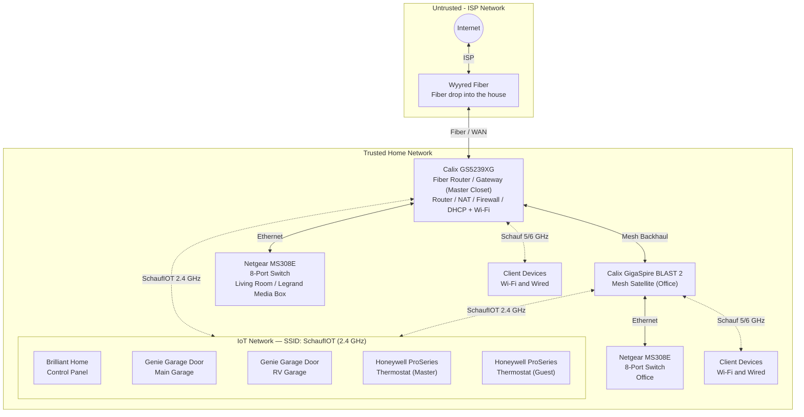
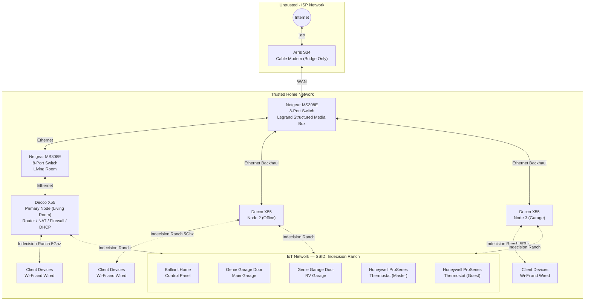
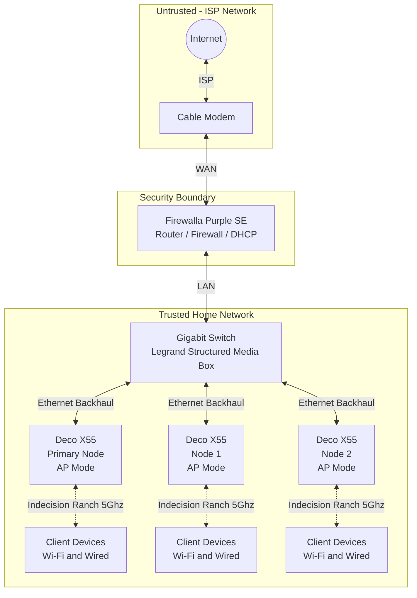

# Current Network Diagram

**ISP:** Wyyred Fiber (installed 2026-09-29). Fiber runs into the house directly into the Calix router — no separate modem.


```mermaid
flowchart TB
    %% ===== Zones =====
    subgraph WAN_ZONE["Untrusted - ISP Network"]
        Internet((Internet))
        Fiber["Wyyred Fiber<br/>Fiber drop into the house"]
    end

    subgraph LAN_ZONE["Trusted Home Network"]
        %% Layer 1 - Calix Router / Gateway
        Router["Calix GS5239XG<br/>Fiber Router / Gateway (Master Closet)<br/>Router / NAT / Firewall / DHCP + Wi-Fi"]

        %% Layer 2 - Calix Mesh
        Mesh["Calix GigaSpire BLAST 2<br/>Mesh Satellite (Office)"]

        %% Layer 2 - Switches
        LRSwitch["Netgear MS308E<br/>8-Port Switch<br/>Living Room / Legrand Media Box"]
        OfficeSwitch["Netgear MS308E<br/>8-Port Switch<br/>Office"]

        %% Layer 3 - Client Devices
        ClientsRouter["Client Devices<br/>Wi-Fi and Wired"]
        ClientsMesh["Client Devices<br/>Wi-Fi and Wired"]

        %% Layer 4 - IoT Devices
        subgraph IOT_ZONE["IoT Network — SSID: SchaufIOT (2.4 GHz)"]
            direction LR
            Brilliant["Brilliant Home<br/>Control Panel"] ~~~ GarageMain["Genie Garage Door<br/>Main Garage"] ~~~ GarageRV["Genie Garage Door<br/>RV Garage"] ~~~ ThermoMaster["Honeywell ProSeries<br/>Thermostat (Master)"] ~~~ ThermoGuest["Honeywell ProSeries<br/>Thermostat (Guest)"]
        end
    end

    %% ===== Links =====
    Internet <-->|ISP| Fiber
    Fiber <-->|Fiber / WAN| Router

    %% Router to switches and mesh
    Router <-->|Ethernet| LRSwitch
    Router <-->|Mesh Backhaul| Mesh
    Mesh <-->|Ethernet| OfficeSwitch

    %% Wi-Fi to clients (Schauf 5/6 GHz)
    Router <-.->|Schauf 5/6 GHz| ClientsRouter
    Mesh <-.->|Schauf 5/6 GHz| ClientsMesh

    %% IoT Wi-Fi (SchaufIOT 2.4 GHz)
    Router <-.->|SchaufIOT 2.4 GHz| IOT_ZONE
    Mesh <-.->|SchaufIOT 2.4 GHz| IOT_ZONE
```

**Key facts:**
- Fiber runs directly into the Calix GS5239XG router — there is no separate modem/ONT box to document
- The Calix GS5239XG is the router, NAT gateway, firewall, DHCP server, and primary Wi-Fi access point
- The Calix GigaSpire BLAST 2 (GM2028) mesh satellite (in the office) extends Wi-Fi coverage
- The Calix router sits in the Legrand media box in the master bedroom closet (same spot as the old equipment)
- Primary client SSID: **Schauf** (5 GHz + 6 GHz)
- IoT SSID: **SchaufIOT** (2.4 GHz)
- Both Macs (office) use 2.5 GbE adapters into the office switch

## IoT Devices

| Device | Location | SSID |
|--------|----------|------|
| Brilliant Home Control Panel | — | SchaufIOT |
| Genie Garage Door (Main) | Main Garage | SchaufIOT |
| Genie Garage Door (RV) | RV Garage | SchaufIOT |
| Honeywell ProSeries Thermostat (Master) | Master | SchaufIOT |
| Honeywell ProSeries Thermostat (Guest) | Guest | SchaufIOT |

## Final Topology

```
Wyyred Fiber (fiber drop into the house)
    │
Calix GS5239XG Router / Gateway (Master Closet)  ← Router / NAT / Firewall / DHCP + Wi-Fi
    ├── Netgear MS308E Switch (Living Room)
    └── Calix GigaSpire BLAST 2 Mesh (Office) ── Netgear MS308E Switch (Office) ── Macs (2.5 GbE)
    │
Clients (Wi-Fi: Schauf 5/6 GHz, SchaufIOT 2.4 GHz)
```

# Network Equipment

## Router / Gateway — Calix GS5239XG

Wyyred-provided fiber router. Fiber terminates directly into this unit; it handles routing, NAT, firewall, DHCP, and primary Wi-Fi.

| Field | Value |
|-------|-------|
| Model | Calix GS5239XG |
| Role | Router / NAT / Firewall / DHCP + Wi-Fi AP |
| Location | Master Bedroom Closet / Legrand Media Box |
| Admin IP | 192.168.1.1 |
| Management | Wyyred / Calix app *(to verify)* |
| Credentials | 1Password |

## Mesh Satellite — Calix GigaSpire BLAST

Mesh unit extending Wi-Fi into the office.

| Field | Value |
|-------|-------|
| Model | Calix GigaSpire BLAST 2 (GM2028) |
| Location | Office |
| Backhaul | *(to verify — wireless or wired to Calix router)* |

## Switches — Netgear MS308E-100NAS

Two Netgear MS308E 8-port multi-gigabit unmanaged plus switches.

| Location | Device Name | IP Address | Admin Page |
|----------|-------------|-----------|------------|
| Living Room / Legrand Media Box | Living Room Switch | 192.168.1.171 | http://192.168.1.171/ |
| Office | Legrand OfficeSwitch | 192.168.1.219 | http://192.168.1.219/ |

**Notes:**
- The LAN subnet changed to **192.168.1.x** (router at 192.168.1.1) when the Calix router replaced the Decco (old subnet was 192.168.68.x). Re-check switch IPs with the **Netgear Discovery Tool** and update the table above.
- Passwords stored in 1Password
- Admin pages include unique device tokens in the URL path

# Troubleshooting

- Restart the Calix GS5239XG router manually (power-cycle).
- If the router has no internet: check the fiber connection and the status LEDs on the Calix unit; contact Wyyred support if the fiber link is down.
- If clients get 169.254.x.x addresses: confirm the Calix router DHCP is active and the client is on the correct SSID.
- If a device still has an old 192.168.68.x (Decco-era) IP: release/renew DHCP or reboot the client.
- If the office mesh/Wi-Fi drops: check the Calix GigaSpire BLAST satellite backhaul to the router.

# Cutover Procedure (Firewalla → Decco Router)

**Reason for change:** The Firewalla Purple SE has a 500 Mbps port limit, bottlenecking the connection. Removing it and returning the Decco X55 mesh to router mode eliminates this constraint.

## Phase 1 — Reconfigure Decco to Router Mode (Done)

1. Open the **Decco app**
2. Navigate to: **More → Advanced → Operation Mode → Router**
3. Apply the change
4. Reboot all Decco nodes

## Phase 2 — Physical Cutover (Planned Outage)

**Goal:** Remove the Firewalla from the network path and connect the Decco primary directly through the switch to the modem.

### Step 1 — Power Down

1. Power **off**:
   * Cable modem
   * All Decco units
2. Disconnect:
   * Cable modem → Firewalla WAN
   * Firewalla LAN → Switch

### Step 2 — Reconnect Without Firewalla

1. Connect:
   * **Cable modem → Switch** (using the port previously connected to Firewalla)
2. Verify:
   * **Decco primary WAN port → Switch** (should already be connected)
   * The switch passes traffic between modem and Decco primary as if directly connected

### Step 3 — Power-On Sequence

1. Power on **cable modem**
   * Wait until fully online (ISP lights stable)
2. Power on **Decco primary node**
   * Wait for the Decco to obtain a WAN IP from ISP via the modem
3. Power on **remaining Decco nodes**

## Phase 3 — Validation

1. Open the **Decco app** and confirm:
   * Internet status = **Connected**
   * WAN IP assigned by ISP
   * Router mode active, DHCP serving clients
2. Check a client device:
   * IP address from Decco subnet
   * Default gateway = Decco primary LAN IP
3. Verify:
   * No double NAT
   * No stale DHCP leases from Firewalla subnet
   * Speed test shows improvement over previous 500 Mbps cap

---

# Historical: Xfinity Cable + Decco X55 Router

**Status:** Retired 2026-09-29 — replaced by Wyyred Fiber and the Calix GS5239XG router. Decco X55 units removed from service.

Under this configuration the Arris S34 cable modem ran as a bridge and the Decco X55 mesh (in Router mode) handled routing/NAT/firewall/DHCP, on the 192.168.68.x subnet.

## Network Diagram


```mermaid
flowchart TB
    %% ===== Zones =====
    subgraph WAN_ZONE["Untrusted - ISP Network"]
        Internet((Internet))
        Modem["Arris S34<br/>Cable Modem (Bridge Only)"]
    end

    subgraph LAN_ZONE["Trusted Home Network"]
        %% Layer 1 - Main Switch
        Switch["Netgear MS308E<br/>8-Port Switch<br/>Legrand Structured Media Box"]

        %% Layer 2 - Living Room Switch
        LRSwitch["Netgear MS308E<br/>8-Port Switch<br/>Living Room"]

        %% Layer 3 - Decco Units
        DeccoMain["Decco X55<br/>Primary Node (Living Room)<br/>Router / NAT / Firewall / DHCP"]
        DeccoNode2["Decco X55<br/>Node 2 (Office)"]
        DeccoNode3["Decco X55<br/>Node 3 (Garage)"]

        %% Layer 4 - Client Devices
        ClientsMain["Client Devices<br/>Wi-Fi and Wired"]
        ClientsNode2["Client Devices<br/>Wi-Fi and Wired"]
        ClientsNode3["Client Devices<br/>Wi-Fi and Wired"]

        %% Layer 5 - IoT Devices
        subgraph IOT_ZONE_HIST["IoT Network — SSID: Indecision Ranch"]
            direction LR
            Brilliant["Brilliant Home<br/>Control Panel"] ~~~ GarageMain["Genie Garage Door<br/>Main Garage"] ~~~ GarageRV["Genie Garage Door<br/>RV Garage"] ~~~ ThermoMaster["Honeywell ProSeries<br/>Thermostat (Master)"] ~~~ ThermoGuest["Honeywell ProSeries<br/>Thermostat (Guest)"]
        end
    end

    %% ===== Links =====
    Internet <-->|ISP| Modem
    Modem <-->|WAN| Switch

    %% Layer 1 to Layer 2
    Switch <-->|Ethernet| LRSwitch
    Switch <-->|Ethernet Backhaul| DeccoNode2
    Switch <-->|Ethernet Backhaul| DeccoNode3

    %% Layer 2 to Layer 3
    LRSwitch <-->|Ethernet| DeccoMain

    %% Layer 3 to Layer 4 (5Ghz Wi-Fi)
    DeccoMain <-.->|Indecision Ranch 5Ghz| ClientsMain
    DeccoNode2 <-.->|Indecision Ranch 5Ghz| ClientsNode2
    DeccoNode3 <-.->|Indecision Ranch 5Ghz| ClientsNode3

    %% Layer 4 to Layer 5 (IoT Wi-Fi)
    DeccoMain <-.->|Indecision Ranch| IOT_ZONE_HIST
    DeccoNode2 <-.->|Indecision Ranch| IOT_ZONE_HIST
    DeccoNode3 <-.->|Indecision Ranch| IOT_ZONE_HIST
```

**Key facts (historical):**
- The Arris S34 cable modem was a bridge only — no routing, no DHCP
- The Decco X55 primary node acted as the router, NAT gateway, firewall, and DHCP server
- All Decco nodes were in Router mode (not Access Point mode)
- IoT SSID: "Indecision Ranch"; primary client SSID: "Indecision Ranch 5Ghz"
- LAN subnet: 192.168.68.x

## Final Topology (historical)

```
Arris S34 Cable Modem (bridge only)
    │
Gigabit Switch
    │
Decco X55 Primary (Living Room)  ← Router / NAT / Firewall / DHCP
    │
Decco X55 Nodes (Office, Garage — mesh backhaul via switch)
    │
Clients
```

## Switch IPs (historical, 192.168.68.x subnet)

| Location | IP Address | Admin Page |
|----------|-----------|------------|
| Legrand Structured Media Box | 192.168.68.62 | http://192.168.68.62/g/4726405376036baf5188333976e86fb8 |
| Living Room | 192.168.68.70 | http://192.168.68.70/g/8ad03da8d74e4a6c67234430027fa86e |

## Troubleshooting (historical — cable/Decco era)

- Restart the modem manually
- Restart via the Xfinity app if this local restart does not fix the issue. DHCP gets reset when Xfinity resets the modem.
- If Decco does not get a WAN IP: power-cycle the modem, then the Decco primary. The modem may need to re-learn the new MAC address.
- If clients get 169.254.x.x addresses: confirm Decco DHCP is enabled in router mode settings.
- If old devices still have Firewalla-subnet IPs: release/renew DHCP or reboot the client.

---

# Historical: Configuration With Firewalla Purple SE

**Status:** Retired — Firewalla Purple SE port limited to 500 Mbps, creating a bottleneck.

## Network Diagram


```mermaid
flowchart TB
    %% ===== Zones =====
    subgraph WAN_ZONE["Untrusted - ISP Network"]
        Internet((Internet))
        Modem[Cable Modem]
    end

    subgraph TRUST_BOUNDARY["Security Boundary<br/>Routing - NAT - Firewall - DHCP"]
        Firewalla["Firewalla Purple SE<br/>Router / Firewall / DHCP"]
    end

    subgraph LAN_ZONE["Trusted Home Network"]
        Switch["Gigabit Switch<br/>Legrand Structured Media Box"]

        DecoMain["Deco X55<br/>Primary Node<br/>AP Mode"]
        DecoNode1["Deco X55<br/>Node 1<br/>AP Mode"]
        DecoNode2["Deco X55<br/>Node 2<br/>AP Mode"]

        ClientsMain["Client Devices<br/>Wi-Fi and Wired"]
        ClientsNode1["Client Devices<br/>Wi-Fi and Wired"]
        ClientsNode2["Client Devices<br/>Wi-Fi and Wired"]
    end

    %% ===== Links =====
    Internet <-->|ISP| Modem
    Modem <-->|WAN| Firewalla
    Firewalla <-->|LAN| Switch

    Switch <-->|Ethernet Backhaul| DecoMain
    Switch <-->|Ethernet Backhaul| DecoNode1
    Switch <-->|Ethernet Backhaul| DecoNode2

    DecoMain <-.->|Indecision Ranch 5Ghz| ClientsMain
    DecoNode1 <-.->|Indecision Ranch 5Ghz| ClientsNode1
    DecoNode2 <-.->|Indecision Ranch 5Ghz| ClientsNode2
```

## Final Topology

```
Cable Modem
    │
Firewalla Purple SE  ← Router / DHCP / Firewall
    │
Switch (optional)
    │
Deco X55 Mesh (Access Point mode)
    │
Clients
```

## Implementation Notes

### Phase 1 — Pre-Stage the Deco Mesh (No Outage)

**Goal:** Remove all routing/DHCP behavior from the Deco system *before* inserting the new router.

1. Open the **Deco app**
2. Navigate to:
   **More → Advanced → Operation Mode → Access Point**
3. Apply the change
4. Reboot **all** Deco nodes
5. Verify:

   * Deco reports **Access Point mode**
   * Wi-Fi remains functional
   * No DHCP warnings appear on clients

Leave the Deco system powered on and connected LAN-side only.

### Phase 2 — Router Cutover (Planned Outage)

**Goal:** Insert Firewalla as the *only* Layer-3 device.

#### Step 1 — Physically Remove the Old Router Path

(The "old router" is the main Deco unit.)

1. Power **off**:

   * Cable modem
   * Firewalla
   * All Deco units
2. Disconnect the Ethernet cable between:

   * Cable modem → main Deco

At this point, the Deco system has **no WAN path**.

---

#### Step 2 — Insert Firewalla

1. Connect:

   * **Cable modem → Firewalla WAN**
2. Connect:

   * **Firewalla LAN → switch**
     **OR**
   * **Firewalla LAN → main Deco LAN port**

Do **not** power anything on yet.

---

#### Step 3 — Power-On Sequence (Critical)

1. Power on **cable modem**

   * Wait until fully online (ISP lights stable)
2. Power on **Firewalla Purple SE**

   * Firewalla automatically:

     * Acts as a DHCP client on WAN
     * Brings up a temporary LAN for onboarding
3. Leave Deco powered **off** for now

---

#### Step 4 — Firewalla First-Time Setup & WAN Confirmation

1. Open the **Firewalla mobile app**
2. Start **Add Firewalla**
3. Complete onboarding
4. Confirm in the app:

   * WAN status = **Connected**
   * WAN IP assigned by ISP
   * Internet access confirmed

If WAN is **not** connected:

* Power-cycle the modem
* Ensure only Firewalla is connected
* Retry onboarding

---

#### Step 5 — Bring the Deco Mesh Online

1. Power on **all Deco units**
2. Confirm in the Deco app:

   * System is in **Access Point mode**
   * All nodes are online
3. Clients should reconnect automatically

---

### Phase 3 — Validation & Stabilization

1. Check a client device:

   * IP address from Firewalla subnet
   * Default gateway = Firewalla LAN IP
2. Verify:

   * No double NAT
   * No duplicate DHCP servers
3. (Optional) Reserve IPs for:

   * TVs
   * Streaming devices
   * NAS / printers
